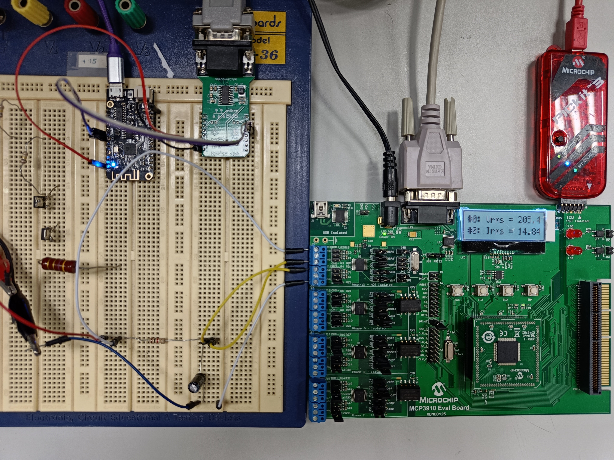

# EnergyMeter
A digital watt-meter system has being designed. It measures the electric power used by a
single phase load in an electric circuit. This is a PIC microcontroler-based watt-meter prototype capable of reading voltage and current
waves. It uses the readings to calculate power-related data and then sends them to an LCD screen and to an ESP32 development board, which is in charge
of transmitting the data via WiFi. When accessing the ESP32’s local IP address in a LAN through a web browser, the user can see the real-time data displayed
in graphs.

***It has only been tested using fictional loads.*** An RC circuit was used to simulate a phase shift.  By choosing R = 1kΩ and C = 47µF the theoretical maximum voltage
at the resistor would be VR = 498.9mV and, at the capacitor, 33.8mV.

This repository covers the ADC Concverter and the MCU module. The code for the wifi module can be found [here](https://github.com/rucoma00/EnergyMeter_WiFi_Com).

## Hardware specifications
This design will consider a 50Hz source frequency (Europe). The following picture shows the general schematic that the design follows. 

The [MCP3910 Evaluation board](https://www.microchip.com/en-us/development-tool/adm00425) is used to aquire data. Since the design considers a single-phase application, only one MCP3910 is needed. Device *N* is chosen for the prototype, since the rest of the ADCs will not be used,
meaning that there is no need for isolation. It is configured so that it is always operating in
2-Wire interface (*TWI*) mode, which works in a very similar way to *I2C* and it is compatible with most *I2C* devices. This mode uses the SPI pins to operate.

### Board hardware configuration
The following table describes the hardware cinfiguration of the MCP3910:
|MCP3910 pin| Logic value | Configuration |
| --------- | ----------- | ------------- |
| Current boost | 1 | 1x |
| Gain [1, 0] | [0, 0] | PGA = 1 |
| OSR [1, 0] | [1 ,0] | 256 |

## Software specifications
The *PIC24FJ256GA* *MCU* integrated in the evaluation board comes with a firmware that
allows the user to evaluate the performance of one of the four ADCs at a time. The data from
the converters is transmitted via USB to the computer and can be displayed in a *GUI* provided the Microchip PC applications Energy Management Utility
and Hi-Resolution ADC Utility. The latest version of the firmware and the applications can
be found on the [Microchip website](https://www.microchip.com/en-us/development-tool/adm00425).

Most of the code meets the watt-meter design specifications. A a matter of fact, some of
its functions implement tasks that are essential pieces of the code of a digital watt-meter, like
the routine for reading the *ADCs*. For these reasons, the default firmware will be the base for
the *MCP3910 Evaluation Board* software design. New lines of code and functions will be
added on the existing files to create a software application that fulfills the watt-meter design
requirements.

The buffers MSB, NSB and LSB arrays hold 2048 samples by default, using around 80% of
the available memory. The new software will make use of new arrays and variables that will
also use a large amount of memory so the buffer size must be reduced. In order to capture a number of samples sufficient for this application, the new buffer length
is chosen to be BUFFER LENGHT = 250. This number allows to sample more
than 3 periods of the signal every cycle, which produces enough data to perform the calculations.

### Foreground process
The following algorithm describes the foreground process carried by the microcontroller: 

The cotinous loop performs the following algorithm:

### Background process
The following algorith describes the background (interrupt) process:

